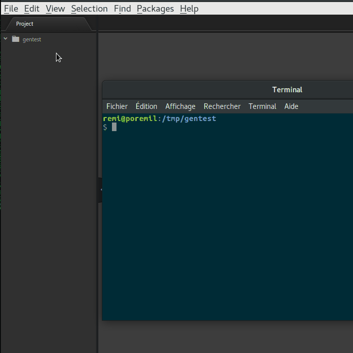
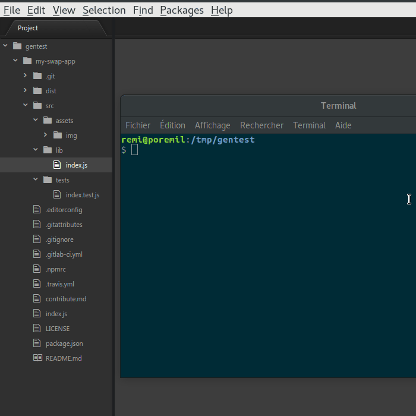

# generate-swap-project

<p style="text-align:center">
  By <br/>
  <span style="font-weight: bold; font-style: italic; font-size:1.5em">
    −− Generate An ES.Next Ready Project in Seconds! −−
    <br>
    −− A generator for SWAP projects −−
  </span><br>
  <a href="https://npmjs.org/package/generate-swap-project" target="_blank">
    
  </a>
  <a href="https://travis-ci.org/rbecheras/generate-swap-project" target="_blank">
    
  </a>
  <a href="https://standardjs.com" target="_blank">
    
  </a>
</p>

## Installation

```sh
$ npm install --global generate generate-swap-project
```

## Usage

```sh
$ gen swap-project
```

Should scaffold the project in the destination path you choose when asked.

### Generated files

```
.
├─┬ src/
| ├─┬ tests/
| | └─ index.test.js
| ├─┬ assets/
| | └─┬ img/
| |   └── ...
| └─┬ lib/
|   └─ index.js
├── contributing.md
├── .editorconfig
├── .git
├── .gitattributes
├── .gitignore
├── .gitlab-ci.yml
├── index.js
├── LICENSE
├── node_modules
├── .npmrc
├── package.json
├── README.md
└── .travis.yml
```

### Generating the `my-swap-app` project



### Then install dependencies and run the unit tests



## Available Generator's Tasks

### `swap-project:default`

Runs the `project` task.

```
$ gen swap-project
```

or

```
$ gen swap-project:default
```

### `swap-project:project`

Generate the whole project in the directory choosen by the user when in ask to the question.

Runs all the following tasks in the following order:

- `prompt`
- `dest`
- `package`
- `gitignore`
- `gitattributes`
- `editorconfig`
- `npmrc`
- `contributing`
- `license`
- `main`
- `readme`
- `travis`
- `gitlabci`
- `git`


```
$ gen swap-project
```

or

```
$ gen swap-project:default
```

### `swap-project:prompt`

Ask the user for all the required data for all the tasks in this generator.

```
$ gen swap-project:prompt
```

### `swap-project:dest`

Set the destination directory for generated files.

```
$ gen swap-project:dest
```

### `swap-project:package`

Generate a `package.json` file.

```
$ gen swap-project:package
```

The file includes:

- basic package.json fields
    - name
    - description
    - version
    - homepage
    - author
    - repository
    - bugs
    - license
    - files
    - main
    - engines
    - keywords
- dependencies
- devDependencies
- 27 yarn scripts
- babeljs config
- standardjs config

### `swap-project:git`

Create a local git repository, add all files in the directory and create a first commit.

```
$ gen swap-project:git
```

### `swap-project:gitignore`

Generate a file `.gitignore` in the destination directory.

```
$ gen swap-project:gitignore
```

### `swap-project:gitattributes`

Generate a file `.gitattributes` in the destination directory.

```
$ gen swap-project:gitattributes
```

### `swap-project:editorconfig`

Generate a file `.editorconfig` in the destination directory.

```
$ gen swap-project:editorconfig
```

### `swap-project:npmrc`

Generate a file `.npmrc` in the destination directory.

```
$ gen swap-project:npmrc
```

### `swap-project:contributing`

Generate a file `.contributing.md` in the destination directory.

```
$ gen swap-project:contributing
```

### `swap-project:lincense`

Generate a file `LICENSE` in the destination directory.

```
$ gen swap-project:lincense
```

### `swap-project:main`

Generate a file `main.js` in the destination directory.

```
$ gen swap-project:main
```

### `swap-project:readme`

Generate a file `README.md` in the destination directory.

```
$ gen swap-project:readme
```

### `swap-project:travis`

Generate a file `.travis` in the destination directory.

```
$ gen swap-project:travis
```

### `swap-project:gitlabci`

Generate a file `.gitlab-ci.yml` in the destination directory.

```
$ gen swap-project:gitlabci
```

## Contributing

### Codebase

The codebase is written using the [ESNext Specification](https://github.com/hemanth/es-next) (ECMAScript Stage 0), following the [StandardJS Code Style](https://standardjs.com/)

[](https://github.com/hemanth/es-next)
[](https://github.com/standard/standard)
[](https://eslint.org)
[](https://babeljs.io)
[](https://yarnpkg.com/en/)

We use:

- [Yarn](https://yarnpkg.com/fr/) to handle npm dependencies,
- [ESNext CLI](https://github.com/esnext/esnext) to transform ESx code to ESNext,
- [Babel CLI](https://babeljs.io/) to transpile ESNext code to node/browser compatible javascript,
- And [Standard CLI](https://www.npmjs.com/package/standard) + [ESLint](https://eslint.org) to lint or format ESNext codebase.

### Contribution guide

> See the [contribution guide](CONTRIBUTING.md) in a separated document.

### Development

#### Global dependencies

Get the latest node engine (example with `nvm`):

```sh
$ nvm install lts/carbon
```

Install yarn from npm (for development only):

```sh
$ npm install --global yarn
```

All the rest of the development dependencies are local.

#### Clone and install

Clone the repo and install dependencies:

```sh
$ git clone git@github.com:rbecheras/generate-swap-project.git
$ cd generate-swap-project
$ yarn install
```
#### Running test

Finally, run the test pipeline:

```sh
$ yarn pipeline:test
```

#### Available yarn scripts

| Task Command | Task description |
|---|---|
| `yarn clear` | Delete the `./build/` and `./dist` repositories |
| `yarn lint` | Lint source files |
| `yarn lint:esnext` | Lint ESNext source files |
| `yarn build` | Build the whole distribution |
| `yarn build:assets` | Build all the assets |
| `yarn build:assets:img` | Build the images assets |
| `yarn build:assets:templates` | Build the templates assets |
| `yarn build:lib` | Build only the lib |
| `yarn build:tests` | Build only the tests |
| `yarn build:docs` | **[TODO]** Build only the docs |
| `yarn test` | Run the tests in `./dist/tests/` |
| `yarn tests` | An alias for `yarn test` |
| `yarn travis` | Run the travis script |
| `yarn docs` | **[TODO]** Serve the docs |
| `yarn pipeline` | Run the complete pipeline |
| `yarn pipeline:test` | Run the required jobs to run the tests, then run the tests |
| `yarn pipeline:build` | Run the required jobs to build the dist, then build the dist |
| `yarn pipeline:docs` | **[TODO]** Run the required jobs to serve the docs, then serve the docs |
| `yarn pipeline:build:tests` | Run the required jobs to build the docs, then build the docs |
| `yarn pipeline:build:lib` | Run the required jobs to build the docs, then build the docs |
| `yarn pipeline:build:docs` | **[TODO]** Run the required jobs to build the docs, then build the docs |
| `yarn release` | An alias to `yarn release:patch` |
| `yarn release:prerelease` | Release and publish a new semver version (x.y.z-rc+1)|
| `yarn release:patch` | Release and publish a new patch semver version (`x.y.z+1`)|
| `yarn release:minor` | Release and publish a new minor semver version (`x.y+1.z=0`)|
| `yarn release:major` | Release and publish a new major semver version (`x+1.y=0.z=0`)|

#### Releasing a new version

The task `yarn pipeline:build` generate a `./dist` folder in the repository's root directory but this folder is not part of the git repository (there is an entry in the `.gitignore` file). However the dist folder is included in the `package.json#files` field.

Thus to release a new, lets say, "patch" version, just run:

```sh
$ yarn release:patch
```

The whole build pipeline is run locally (lint, transpile, test) and then a new git tag and a new npm tag are pushed up.

## License

MIT © [Rémi Becheras](https://github.com/rbecheras)
